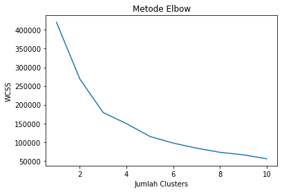
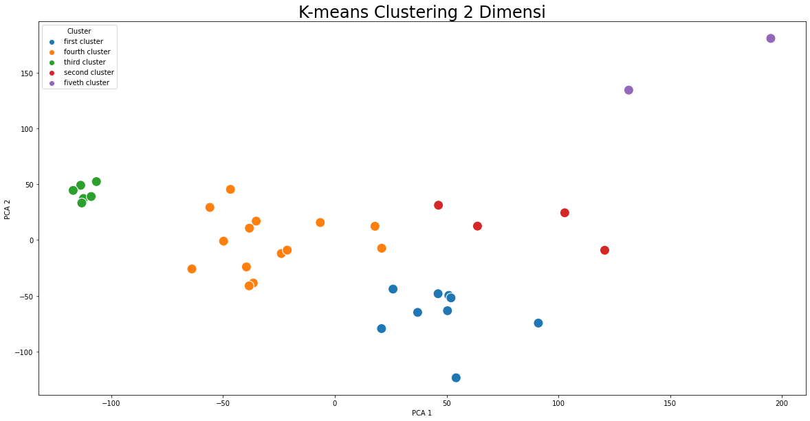

# Import the dataset


```python
import pandas as pd
import numpy as np
import matplotlib.pyplot as plt
```


```python
#  import dataset
data_dbd = pd.read_excel('Data DBD Jawa Tengah.xlsx')

# filtering the dataset that we needed, ignore the unnecessarry column
data_dbd_filter=data_dbd.iloc[6:41,[2,3,5,7,9,11,13,15,17,19,21,23,25]]

# rename the column	#E9967A
final_data_dbd=data_dbd_filter.rename(columns={'Unnamed: 2':'Kabupaten/Kodya',
                                              'Unnamed: 3':'Jan',
                                              'Unnamed: 5':'Feb',
                                              'Unnamed: 7':'Mar',
                                              'Unnamed: 9':'Apr',
                                              'Unnamed: 11':'May',
                                              'Unnamed: 13':'Jun',
                                              'Unnamed: 15':'Jul',
                                              'Unnamed: 17':'Aug',
                                              'Unnamed: 19':'Sep',
                                              'Unnamed: 21':'Okt',
                                              'Unnamed: 23':'Nov',
                                              'Unnamed: 25':'Des'})

# reset the index
final_data_dbd.reset_index(drop=True, inplace=True)

# show our boauty dataset
final_data_dbd
```


<div>
<style scoped>
    .dataframe tbody tr th:only-of-type {
        vertical-align: middle;
    }

    .dataframe tbody tr th {
        vertical-align: top;
    }

    .dataframe thead th {
        text-align: right;
    }
</style>
<table border="1" class="dataframe">
  <thead>
    <tr style="text-align: right;">
      <th></th>
      <th>Kabupaten/Kodya</th>
      <th>Jan</th>
      <th>Feb</th>
      <th>Mar</th>
      <th>Apr</th>
      <th>May</th>
      <th>Jun</th>
      <th>Jul</th>
      <th>Aug</th>
      <th>Sep</th>
      <th>Okt</th>
      <th>Nov</th>
      <th>Des</th>
    </tr>
  </thead>
  <tbody>
    <tr>
      <th>0</th>
      <td>CILACAP</td>
      <td>62</td>
      <td>76</td>
      <td>70</td>
      <td>101</td>
      <td>67</td>
      <td>92</td>
      <td>78</td>
      <td>48</td>
      <td>12</td>
      <td>16</td>
      <td>16</td>
      <td>16</td>
    </tr>
    <tr>
      <th>1</th>
      <td>BANYUMAS</td>
      <td>32</td>
      <td>157</td>
      <td>29</td>
      <td>134</td>
      <td>68</td>
      <td>21</td>
      <td>9</td>
      <td>8</td>
      <td>4</td>
      <td>16</td>
      <td>11</td>
      <td>15</td>
    </tr>
    <tr>
      <th>2</th>
      <td>PURBALINGGA</td>
      <td>56</td>
      <td>36</td>
      <td>52</td>
      <td>4</td>
      <td>10</td>
      <td>32</td>
      <td>25</td>
      <td>4</td>
      <td>8</td>
      <td>0</td>
      <td>11</td>
      <td>13</td>
    </tr>
    <tr>
      <th>3</th>
      <td>BANJARNEGARA</td>
      <td>53</td>
      <td>85</td>
      <td>37</td>
      <td>47</td>
      <td>48</td>
      <td>13</td>
      <td>21</td>
      <td>4</td>
      <td>2</td>
      <td>3</td>
      <td>4</td>
      <td>13</td>
    </tr>
    <tr>
      <th>4</th>
      <td>KEBUMEN</td>
      <td>49</td>
      <td>44</td>
      <td>50</td>
      <td>39</td>
      <td>82</td>
      <td>50</td>
      <td>11</td>
      <td>0</td>
      <td>3</td>
      <td>16</td>
      <td>9</td>
      <td>13</td>
    </tr>
    <tr>
      <th>5</th>
      <td>PURWOREJO</td>
      <td>47</td>
      <td>29</td>
      <td>32</td>
      <td>29</td>
      <td>28</td>
      <td>22</td>
      <td>12</td>
      <td>0</td>
      <td>3</td>
      <td>3</td>
      <td>0</td>
      <td>12</td>
    </tr>
    <tr>
      <th>6</th>
      <td>WONOSOBO</td>
      <td>7</td>
      <td>5</td>
      <td>10</td>
      <td>9</td>
      <td>12</td>
      <td>12</td>
      <td>2</td>
      <td>4</td>
      <td>3</td>
      <td>0</td>
      <td>0</td>
      <td>0</td>
    </tr>
    <tr>
      <th>7</th>
      <td>MAGELANG</td>
      <td>40</td>
      <td>55</td>
      <td>51</td>
      <td>52</td>
      <td>15</td>
      <td>4</td>
      <td>13</td>
      <td>2</td>
      <td>1</td>
      <td>16</td>
      <td>13</td>
      <td>7</td>
    </tr>
    <tr>
      <th>8</th>
      <td>BOYOLALI</td>
      <td>95</td>
      <td>121</td>
      <td>28</td>
      <td>74</td>
      <td>34</td>
      <td>11</td>
      <td>26</td>
      <td>7</td>
      <td>7</td>
      <td>14</td>
      <td>15</td>
      <td>4</td>
    </tr>
    <tr>
      <th>9</th>
      <td>KLATEN</td>
      <td>40</td>
      <td>65</td>
      <td>107</td>
      <td>126</td>
      <td>66</td>
      <td>26</td>
      <td>51</td>
      <td>28</td>
      <td>2</td>
      <td>16</td>
      <td>15</td>
      <td>10</td>
    </tr>
    <tr>
      <th>10</th>
      <td>SUKOHARJO</td>
      <td>13</td>
      <td>21</td>
      <td>43</td>
      <td>52</td>
      <td>61</td>
      <td>31</td>
      <td>26</td>
      <td>16</td>
      <td>7</td>
      <td>11</td>
      <td>5</td>
      <td>3</td>
    </tr>
    <tr>
      <th>11</th>
      <td>WONOGIRI</td>
      <td>20</td>
      <td>8</td>
      <td>2</td>
      <td>11</td>
      <td>3</td>
      <td>1</td>
      <td>2</td>
      <td>1</td>
      <td>1</td>
      <td>2</td>
      <td>0</td>
      <td>1</td>
    </tr>
    <tr>
      <th>12</th>
      <td>KARANGANYAR</td>
      <td>22</td>
      <td>35</td>
      <td>44</td>
      <td>75</td>
      <td>45</td>
      <td>39</td>
      <td>66</td>
      <td>43</td>
      <td>31</td>
      <td>25</td>
      <td>12</td>
      <td>10</td>
    </tr>
    <tr>
      <th>13</th>
      <td>SRAGEN</td>
      <td>56</td>
      <td>100</td>
      <td>110</td>
      <td>110</td>
      <td>71</td>
      <td>46</td>
      <td>20</td>
      <td>16</td>
      <td>9</td>
      <td>20</td>
      <td>19</td>
      <td>16</td>
    </tr>
    <tr>
      <th>14</th>
      <td>GROBOGAN</td>
      <td>120</td>
      <td>132</td>
      <td>152</td>
      <td>10</td>
      <td>42</td>
      <td>31</td>
      <td>47</td>
      <td>41</td>
      <td>44</td>
      <td>49</td>
      <td>46</td>
      <td>38</td>
    </tr>
    <tr>
      <th>15</th>
      <td>BLORA</td>
      <td>282</td>
      <td>204</td>
      <td>25</td>
      <td>15</td>
      <td>8</td>
      <td>9</td>
      <td>6</td>
      <td>12</td>
      <td>9</td>
      <td>17</td>
      <td>10</td>
      <td>13</td>
    </tr>
    <tr>
      <th>16</th>
      <td>REMBANG</td>
      <td>222</td>
      <td>150</td>
      <td>18</td>
      <td>13</td>
      <td>26</td>
      <td>13</td>
      <td>45</td>
      <td>25</td>
      <td>26</td>
      <td>16</td>
      <td>28</td>
      <td>17</td>
    </tr>
    <tr>
      <th>17</th>
      <td>PATI</td>
      <td>89</td>
      <td>116</td>
      <td>121</td>
      <td>43</td>
      <td>25</td>
      <td>16</td>
      <td>41</td>
      <td>23</td>
      <td>11</td>
      <td>59</td>
      <td>19</td>
      <td>31</td>
    </tr>
    <tr>
      <th>18</th>
      <td>KUDUS</td>
      <td>55</td>
      <td>157</td>
      <td>108</td>
      <td>116</td>
      <td>96</td>
      <td>49</td>
      <td>18</td>
      <td>16</td>
      <td>8</td>
      <td>29</td>
      <td>8</td>
      <td>10</td>
    </tr>
    <tr>
      <th>19</th>
      <td>JEPARA</td>
      <td>139</td>
      <td>133</td>
      <td>110</td>
      <td>99</td>
      <td>65</td>
      <td>33</td>
      <td>39</td>
      <td>16</td>
      <td>16</td>
      <td>17</td>
      <td>14</td>
      <td>28</td>
    </tr>
    <tr>
      <th>20</th>
      <td>DEMAK</td>
      <td>76</td>
      <td>56</td>
      <td>20</td>
      <td>118</td>
      <td>73</td>
      <td>43</td>
      <td>73</td>
      <td>44</td>
      <td>25</td>
      <td>38</td>
      <td>39</td>
      <td>35</td>
    </tr>
    <tr>
      <th>21</th>
      <td>SEMARANG</td>
      <td>34</td>
      <td>152</td>
      <td>52</td>
      <td>82</td>
      <td>86</td>
      <td>84</td>
      <td>19</td>
      <td>12</td>
      <td>0</td>
      <td>12</td>
      <td>17</td>
      <td>11</td>
    </tr>
    <tr>
      <th>22</th>
      <td>TEMANGGUNG</td>
      <td>45</td>
      <td>48</td>
      <td>45</td>
      <td>50</td>
      <td>33</td>
      <td>43</td>
      <td>46</td>
      <td>90</td>
      <td>14</td>
      <td>16</td>
      <td>14</td>
      <td>14</td>
    </tr>
    <tr>
      <th>23</th>
      <td>KENDAL</td>
      <td>79</td>
      <td>77</td>
      <td>81</td>
      <td>61</td>
      <td>29</td>
      <td>12</td>
      <td>29</td>
      <td>17</td>
      <td>14</td>
      <td>7</td>
      <td>8</td>
      <td>1</td>
    </tr>
    <tr>
      <th>24</th>
      <td>BATANG</td>
      <td>65</td>
      <td>105</td>
      <td>53</td>
      <td>104</td>
      <td>101</td>
      <td>47</td>
      <td>14</td>
      <td>10</td>
      <td>6</td>
      <td>9</td>
      <td>19</td>
      <td>14</td>
    </tr>
    <tr>
      <th>25</th>
      <td>PEKALONGAN</td>
      <td>31</td>
      <td>31</td>
      <td>64</td>
      <td>43</td>
      <td>18</td>
      <td>46</td>
      <td>12</td>
      <td>7</td>
      <td>8</td>
      <td>18</td>
      <td>12</td>
      <td>9</td>
    </tr>
    <tr>
      <th>26</th>
      <td>PEMALANG</td>
      <td>70</td>
      <td>81</td>
      <td>64</td>
      <td>54</td>
      <td>77</td>
      <td>33</td>
      <td>7</td>
      <td>9</td>
      <td>6</td>
      <td>29</td>
      <td>26</td>
      <td>19</td>
    </tr>
    <tr>
      <th>27</th>
      <td>TEGAL</td>
      <td>27</td>
      <td>60</td>
      <td>61</td>
      <td>41</td>
      <td>16</td>
      <td>10</td>
      <td>17</td>
      <td>8</td>
      <td>5</td>
      <td>23</td>
      <td>6</td>
      <td>10</td>
    </tr>
    <tr>
      <th>28</th>
      <td>BREBES</td>
      <td>57</td>
      <td>66</td>
      <td>108</td>
      <td>151</td>
      <td>125</td>
      <td>73</td>
      <td>42</td>
      <td>32</td>
      <td>12</td>
      <td>20</td>
      <td>17</td>
      <td>16</td>
    </tr>
    <tr>
      <th>29</th>
      <td>KOTA MAGELANG</td>
      <td>2</td>
      <td>6</td>
      <td>11</td>
      <td>8</td>
      <td>18</td>
      <td>4</td>
      <td>9</td>
      <td>5</td>
      <td>2</td>
      <td>5</td>
      <td>2</td>
      <td>1</td>
    </tr>
    <tr>
      <th>30</th>
      <td>KOTA SURAKARTA</td>
      <td>22</td>
      <td>36</td>
      <td>58</td>
      <td>62</td>
      <td>74</td>
      <td>42</td>
      <td>42</td>
      <td>13</td>
      <td>13</td>
      <td>7</td>
      <td>2</td>
      <td>0</td>
    </tr>
    <tr>
      <th>31</th>
      <td>KOTA SALATIGA</td>
      <td>3</td>
      <td>16</td>
      <td>8</td>
      <td>8</td>
      <td>9</td>
      <td>6</td>
      <td>9</td>
      <td>5</td>
      <td>4</td>
      <td>0</td>
      <td>0</td>
      <td>0</td>
    </tr>
    <tr>
      <th>32</th>
      <td>KOTA SEMARANG</td>
      <td>21</td>
      <td>37</td>
      <td>61</td>
      <td>47</td>
      <td>48</td>
      <td>43</td>
      <td>20</td>
      <td>27</td>
      <td>25</td>
      <td>32</td>
      <td>36</td>
      <td>25</td>
    </tr>
    <tr>
      <th>33</th>
      <td>KOTA PEKALONGAN</td>
      <td>5</td>
      <td>14</td>
      <td>4</td>
      <td>4</td>
      <td>2</td>
      <td>2</td>
      <td>1</td>
      <td>0</td>
      <td>2</td>
      <td>1</td>
      <td>1</td>
      <td>0</td>
    </tr>
    <tr>
      <th>34</th>
      <td>KOTA TEGAL</td>
      <td>6</td>
      <td>3</td>
      <td>8</td>
      <td>4</td>
      <td>6</td>
      <td>5</td>
      <td>3</td>
      <td>0</td>
      <td>5</td>
      <td>5</td>
      <td>4</td>
      <td>1</td>
    </tr>
  </tbody>
</table>
</div>


# Process the dataset


```python
final_data_dbd.info()
```

    <class 'pandas.core.frame.DataFrame'>
    RangeIndex: 35 entries, 0 to 34
    Data columns (total 13 columns):
     #   Column           Non-Null Count  Dtype 
    ---  ------           --------------  ----- 
     0   Kabupaten/Kodya  35 non-null     object
     1   Jan              35 non-null     object
     2   Feb              35 non-null     object
     3   Mar              35 non-null     object
     4   Apr              35 non-null     object
     5   May              35 non-null     object
     6   Jun              35 non-null     object
     7   Jul              35 non-null     object
     8   Aug              35 non-null     object
     9   Sep              35 non-null     object
     10  Okt              35 non-null     object
     11  Nov              35 non-null     object
     12  Des              35 non-null     object
    dtypes: object(13)
    memory usage: 3.7+ KB
    


```python
# declareate x as the value of our dataset

X = final_data_dbd.loc[:,['Jan','Feb','Mar',
                    'Apr','May','Jun',
                    'Jul','Aug','Sep',
                    'Okt','Nov','Des']].values
```


```python
# Use elbow method to detemine the number of cluster

from sklearn.cluster import KMeans
wcss = []
for i in range(1,11):
    kmeans=KMeans(n_clusters=i,init='k-means++', random_state=42)
    kmeans.fit(X)
    wcss.append(kmeans.inertia_)
plt.plot(range(1,11),wcss)
plt.title('Metode Elbow')
plt.xlabel('Jumlah Clusters')
plt.ylabel('WCSS')
plt.show()
```


    

    


Berdasarkan metode elbow, jumlah cluster yang terbaik yaitu 2,3,atau 5. Berdasarkan permintaan Bu Dewi diminta membuat 5 cluster. Maka Akan dibentuk cluster daerah penderita dbd sangat tinggi, cukup tinggi, sedang, cukup rendah, rendah


```python
# just incase if you want to save the image

plt.savefig('Metode Elbow.png')
```


    <Figure size 432x288 with 0 Axes>


```python
# find the centroid for each month and each cluster
kmeans=KMeans(n_clusters=5,init='k-means++',random_state=42)
y_kmeans=kmeans.fit_predict(X)

# show the centroid
print(kmeans.cluster_centers_)
```

    [[ 53.         103.77777778  73.         115.77777778  83.66666667
       53.44444444  36.          23.77777778   8.66666667  19.55555556
       17.88888889  15.88888889]
     [110.75       125.5        102.75        56.5         41.5
       22.75        38.25        21.75        19.5         34.75
       23.5         25.25      ]
     [  7.16666667   8.66666667   7.16666667   7.33333333   8.33333333
        5.           4.33333333   2.5          2.83333333   2.16666667
        1.16666667   0.5       ]
     [ 41.07142857  48.21428571  53.07142857  46.85714286  41.71428571
       30.          24.78571429  17.14285714  10.          14.71428571
       11.28571429  10.64285714]
     [252.         177.          21.5         14.          17.
       11.          25.5         18.5         17.5         16.5
       19.          15.        ]]
    

## Clustering the dataset


```python
# show the cluster
print(kmeans.labels_)

# Add column "Claster" into dataset
final_data_dbd['Cluster']=kmeans.labels_
final_data_dbd
```

    [0 0 3 3 3 3 2 3 1 0 3 2 3 0 1 4 4 1 0 1 0 0 3 3 0 3 3 3 0 2 3 2 3 2 2]
    


<div>
<style scoped>
    .dataframe tbody tr th:only-of-type {
        vertical-align: middle;
    }

    .dataframe tbody tr th {
        vertical-align: top;
    }

    .dataframe thead th {
        text-align: right;
    }
</style>
<table border="1" class="dataframe">
  <thead>
    <tr style="text-align: right;">
      <th></th>
      <th>Kabupaten/Kodya</th>
      <th>Jan</th>
      <th>Feb</th>
      <th>Mar</th>
      <th>Apr</th>
      <th>May</th>
      <th>Jun</th>
      <th>Jul</th>
      <th>Aug</th>
      <th>Sep</th>
      <th>Okt</th>
      <th>Nov</th>
      <th>Des</th>
      <th>Cluster</th>
    </tr>
  </thead>
  <tbody>
    <tr>
      <th>0</th>
      <td>CILACAP</td>
      <td>62</td>
      <td>76</td>
      <td>70</td>
      <td>101</td>
      <td>67</td>
      <td>92</td>
      <td>78</td>
      <td>48</td>
      <td>12</td>
      <td>16</td>
      <td>16</td>
      <td>16</td>
      <td>0</td>
    </tr>
    <tr>
      <th>1</th>
      <td>BANYUMAS</td>
      <td>32</td>
      <td>157</td>
      <td>29</td>
      <td>134</td>
      <td>68</td>
      <td>21</td>
      <td>9</td>
      <td>8</td>
      <td>4</td>
      <td>16</td>
      <td>11</td>
      <td>15</td>
      <td>0</td>
    </tr>
    <tr>
      <th>2</th>
      <td>PURBALINGGA</td>
      <td>56</td>
      <td>36</td>
      <td>52</td>
      <td>4</td>
      <td>10</td>
      <td>32</td>
      <td>25</td>
      <td>4</td>
      <td>8</td>
      <td>0</td>
      <td>11</td>
      <td>13</td>
      <td>3</td>
    </tr>
    <tr>
      <th>3</th>
      <td>BANJARNEGARA</td>
      <td>53</td>
      <td>85</td>
      <td>37</td>
      <td>47</td>
      <td>48</td>
      <td>13</td>
      <td>21</td>
      <td>4</td>
      <td>2</td>
      <td>3</td>
      <td>4</td>
      <td>13</td>
      <td>3</td>
    </tr>
    <tr>
      <th>4</th>
      <td>KEBUMEN</td>
      <td>49</td>
      <td>44</td>
      <td>50</td>
      <td>39</td>
      <td>82</td>
      <td>50</td>
      <td>11</td>
      <td>0</td>
      <td>3</td>
      <td>16</td>
      <td>9</td>
      <td>13</td>
      <td>3</td>
    </tr>
    <tr>
      <th>5</th>
      <td>PURWOREJO</td>
      <td>47</td>
      <td>29</td>
      <td>32</td>
      <td>29</td>
      <td>28</td>
      <td>22</td>
      <td>12</td>
      <td>0</td>
      <td>3</td>
      <td>3</td>
      <td>0</td>
      <td>12</td>
      <td>3</td>
    </tr>
    <tr>
      <th>6</th>
      <td>WONOSOBO</td>
      <td>7</td>
      <td>5</td>
      <td>10</td>
      <td>9</td>
      <td>12</td>
      <td>12</td>
      <td>2</td>
      <td>4</td>
      <td>3</td>
      <td>0</td>
      <td>0</td>
      <td>0</td>
      <td>2</td>
    </tr>
    <tr>
      <th>7</th>
      <td>MAGELANG</td>
      <td>40</td>
      <td>55</td>
      <td>51</td>
      <td>52</td>
      <td>15</td>
      <td>4</td>
      <td>13</td>
      <td>2</td>
      <td>1</td>
      <td>16</td>
      <td>13</td>
      <td>7</td>
      <td>3</td>
    </tr>
    <tr>
      <th>8</th>
      <td>BOYOLALI</td>
      <td>95</td>
      <td>121</td>
      <td>28</td>
      <td>74</td>
      <td>34</td>
      <td>11</td>
      <td>26</td>
      <td>7</td>
      <td>7</td>
      <td>14</td>
      <td>15</td>
      <td>4</td>
      <td>1</td>
    </tr>
    <tr>
      <th>9</th>
      <td>KLATEN</td>
      <td>40</td>
      <td>65</td>
      <td>107</td>
      <td>126</td>
      <td>66</td>
      <td>26</td>
      <td>51</td>
      <td>28</td>
      <td>2</td>
      <td>16</td>
      <td>15</td>
      <td>10</td>
      <td>0</td>
    </tr>
    <tr>
      <th>10</th>
      <td>SUKOHARJO</td>
      <td>13</td>
      <td>21</td>
      <td>43</td>
      <td>52</td>
      <td>61</td>
      <td>31</td>
      <td>26</td>
      <td>16</td>
      <td>7</td>
      <td>11</td>
      <td>5</td>
      <td>3</td>
      <td>3</td>
    </tr>
    <tr>
      <th>11</th>
      <td>WONOGIRI</td>
      <td>20</td>
      <td>8</td>
      <td>2</td>
      <td>11</td>
      <td>3</td>
      <td>1</td>
      <td>2</td>
      <td>1</td>
      <td>1</td>
      <td>2</td>
      <td>0</td>
      <td>1</td>
      <td>2</td>
    </tr>
    <tr>
      <th>12</th>
      <td>KARANGANYAR</td>
      <td>22</td>
      <td>35</td>
      <td>44</td>
      <td>75</td>
      <td>45</td>
      <td>39</td>
      <td>66</td>
      <td>43</td>
      <td>31</td>
      <td>25</td>
      <td>12</td>
      <td>10</td>
      <td>3</td>
    </tr>
    <tr>
      <th>13</th>
      <td>SRAGEN</td>
      <td>56</td>
      <td>100</td>
      <td>110</td>
      <td>110</td>
      <td>71</td>
      <td>46</td>
      <td>20</td>
      <td>16</td>
      <td>9</td>
      <td>20</td>
      <td>19</td>
      <td>16</td>
      <td>0</td>
    </tr>
    <tr>
      <th>14</th>
      <td>GROBOGAN</td>
      <td>120</td>
      <td>132</td>
      <td>152</td>
      <td>10</td>
      <td>42</td>
      <td>31</td>
      <td>47</td>
      <td>41</td>
      <td>44</td>
      <td>49</td>
      <td>46</td>
      <td>38</td>
      <td>1</td>
    </tr>
    <tr>
      <th>15</th>
      <td>BLORA</td>
      <td>282</td>
      <td>204</td>
      <td>25</td>
      <td>15</td>
      <td>8</td>
      <td>9</td>
      <td>6</td>
      <td>12</td>
      <td>9</td>
      <td>17</td>
      <td>10</td>
      <td>13</td>
      <td>4</td>
    </tr>
    <tr>
      <th>16</th>
      <td>REMBANG</td>
      <td>222</td>
      <td>150</td>
      <td>18</td>
      <td>13</td>
      <td>26</td>
      <td>13</td>
      <td>45</td>
      <td>25</td>
      <td>26</td>
      <td>16</td>
      <td>28</td>
      <td>17</td>
      <td>4</td>
    </tr>
    <tr>
      <th>17</th>
      <td>PATI</td>
      <td>89</td>
      <td>116</td>
      <td>121</td>
      <td>43</td>
      <td>25</td>
      <td>16</td>
      <td>41</td>
      <td>23</td>
      <td>11</td>
      <td>59</td>
      <td>19</td>
      <td>31</td>
      <td>1</td>
    </tr>
    <tr>
      <th>18</th>
      <td>KUDUS</td>
      <td>55</td>
      <td>157</td>
      <td>108</td>
      <td>116</td>
      <td>96</td>
      <td>49</td>
      <td>18</td>
      <td>16</td>
      <td>8</td>
      <td>29</td>
      <td>8</td>
      <td>10</td>
      <td>0</td>
    </tr>
    <tr>
      <th>19</th>
      <td>JEPARA</td>
      <td>139</td>
      <td>133</td>
      <td>110</td>
      <td>99</td>
      <td>65</td>
      <td>33</td>
      <td>39</td>
      <td>16</td>
      <td>16</td>
      <td>17</td>
      <td>14</td>
      <td>28</td>
      <td>1</td>
    </tr>
    <tr>
      <th>20</th>
      <td>DEMAK</td>
      <td>76</td>
      <td>56</td>
      <td>20</td>
      <td>118</td>
      <td>73</td>
      <td>43</td>
      <td>73</td>
      <td>44</td>
      <td>25</td>
      <td>38</td>
      <td>39</td>
      <td>35</td>
      <td>0</td>
    </tr>
    <tr>
      <th>21</th>
      <td>SEMARANG</td>
      <td>34</td>
      <td>152</td>
      <td>52</td>
      <td>82</td>
      <td>86</td>
      <td>84</td>
      <td>19</td>
      <td>12</td>
      <td>0</td>
      <td>12</td>
      <td>17</td>
      <td>11</td>
      <td>0</td>
    </tr>
    <tr>
      <th>22</th>
      <td>TEMANGGUNG</td>
      <td>45</td>
      <td>48</td>
      <td>45</td>
      <td>50</td>
      <td>33</td>
      <td>43</td>
      <td>46</td>
      <td>90</td>
      <td>14</td>
      <td>16</td>
      <td>14</td>
      <td>14</td>
      <td>3</td>
    </tr>
    <tr>
      <th>23</th>
      <td>KENDAL</td>
      <td>79</td>
      <td>77</td>
      <td>81</td>
      <td>61</td>
      <td>29</td>
      <td>12</td>
      <td>29</td>
      <td>17</td>
      <td>14</td>
      <td>7</td>
      <td>8</td>
      <td>1</td>
      <td>3</td>
    </tr>
    <tr>
      <th>24</th>
      <td>BATANG</td>
      <td>65</td>
      <td>105</td>
      <td>53</td>
      <td>104</td>
      <td>101</td>
      <td>47</td>
      <td>14</td>
      <td>10</td>
      <td>6</td>
      <td>9</td>
      <td>19</td>
      <td>14</td>
      <td>0</td>
    </tr>
    <tr>
      <th>25</th>
      <td>PEKALONGAN</td>
      <td>31</td>
      <td>31</td>
      <td>64</td>
      <td>43</td>
      <td>18</td>
      <td>46</td>
      <td>12</td>
      <td>7</td>
      <td>8</td>
      <td>18</td>
      <td>12</td>
      <td>9</td>
      <td>3</td>
    </tr>
    <tr>
      <th>26</th>
      <td>PEMALANG</td>
      <td>70</td>
      <td>81</td>
      <td>64</td>
      <td>54</td>
      <td>77</td>
      <td>33</td>
      <td>7</td>
      <td>9</td>
      <td>6</td>
      <td>29</td>
      <td>26</td>
      <td>19</td>
      <td>3</td>
    </tr>
    <tr>
      <th>27</th>
      <td>TEGAL</td>
      <td>27</td>
      <td>60</td>
      <td>61</td>
      <td>41</td>
      <td>16</td>
      <td>10</td>
      <td>17</td>
      <td>8</td>
      <td>5</td>
      <td>23</td>
      <td>6</td>
      <td>10</td>
      <td>3</td>
    </tr>
    <tr>
      <th>28</th>
      <td>BREBES</td>
      <td>57</td>
      <td>66</td>
      <td>108</td>
      <td>151</td>
      <td>125</td>
      <td>73</td>
      <td>42</td>
      <td>32</td>
      <td>12</td>
      <td>20</td>
      <td>17</td>
      <td>16</td>
      <td>0</td>
    </tr>
    <tr>
      <th>29</th>
      <td>KOTA MAGELANG</td>
      <td>2</td>
      <td>6</td>
      <td>11</td>
      <td>8</td>
      <td>18</td>
      <td>4</td>
      <td>9</td>
      <td>5</td>
      <td>2</td>
      <td>5</td>
      <td>2</td>
      <td>1</td>
      <td>2</td>
    </tr>
    <tr>
      <th>30</th>
      <td>KOTA SURAKARTA</td>
      <td>22</td>
      <td>36</td>
      <td>58</td>
      <td>62</td>
      <td>74</td>
      <td>42</td>
      <td>42</td>
      <td>13</td>
      <td>13</td>
      <td>7</td>
      <td>2</td>
      <td>0</td>
      <td>3</td>
    </tr>
    <tr>
      <th>31</th>
      <td>KOTA SALATIGA</td>
      <td>3</td>
      <td>16</td>
      <td>8</td>
      <td>8</td>
      <td>9</td>
      <td>6</td>
      <td>9</td>
      <td>5</td>
      <td>4</td>
      <td>0</td>
      <td>0</td>
      <td>0</td>
      <td>2</td>
    </tr>
    <tr>
      <th>32</th>
      <td>KOTA SEMARANG</td>
      <td>21</td>
      <td>37</td>
      <td>61</td>
      <td>47</td>
      <td>48</td>
      <td>43</td>
      <td>20</td>
      <td>27</td>
      <td>25</td>
      <td>32</td>
      <td>36</td>
      <td>25</td>
      <td>3</td>
    </tr>
    <tr>
      <th>33</th>
      <td>KOTA PEKALONGAN</td>
      <td>5</td>
      <td>14</td>
      <td>4</td>
      <td>4</td>
      <td>2</td>
      <td>2</td>
      <td>1</td>
      <td>0</td>
      <td>2</td>
      <td>1</td>
      <td>1</td>
      <td>0</td>
      <td>2</td>
    </tr>
    <tr>
      <th>34</th>
      <td>KOTA TEGAL</td>
      <td>6</td>
      <td>3</td>
      <td>8</td>
      <td>4</td>
      <td>6</td>
      <td>5</td>
      <td>3</td>
      <td>0</td>
      <td>5</td>
      <td>5</td>
      <td>4</td>
      <td>1</td>
      <td>2</td>
    </tr>
  </tbody>
</table>
</div>


```python
# rename the clustername
final_data_dbd['Cluster']=final_data_dbd['Cluster'].replace(0,'first cluster')
final_data_dbd['Cluster']=final_data_dbd['Cluster'].replace(1,'second cluster')
final_data_dbd['Cluster']=final_data_dbd['Cluster'].replace(2,'third cluster')
final_data_dbd['Cluster']=final_data_dbd['Cluster'].replace(3,'fourth cluster')
final_data_dbd['Cluster']=final_data_dbd['Cluster'].replace(4,'fiveth cluster')

# show the dataframe
final_data_dbd
```


<div>
<style scoped>
    .dataframe tbody tr th:only-of-type {
        vertical-align: middle;
    }

    .dataframe tbody tr th {
        vertical-align: top;
    }

    .dataframe thead th {
        text-align: right;
    }
</style>
<table border="1" class="dataframe">
  <thead>
    <tr style="text-align: right;">
      <th></th>
      <th>Kabupaten/Kodya</th>
      <th>Jan</th>
      <th>Feb</th>
      <th>Mar</th>
      <th>Apr</th>
      <th>May</th>
      <th>Jun</th>
      <th>Jul</th>
      <th>Aug</th>
      <th>Sep</th>
      <th>Okt</th>
      <th>Nov</th>
      <th>Des</th>
      <th>Cluster</th>
    </tr>
  </thead>
  <tbody>
    <tr>
      <th>0</th>
      <td>CILACAP</td>
      <td>62</td>
      <td>76</td>
      <td>70</td>
      <td>101</td>
      <td>67</td>
      <td>92</td>
      <td>78</td>
      <td>48</td>
      <td>12</td>
      <td>16</td>
      <td>16</td>
      <td>16</td>
      <td>first cluster</td>
    </tr>
    <tr>
      <th>1</th>
      <td>BANYUMAS</td>
      <td>32</td>
      <td>157</td>
      <td>29</td>
      <td>134</td>
      <td>68</td>
      <td>21</td>
      <td>9</td>
      <td>8</td>
      <td>4</td>
      <td>16</td>
      <td>11</td>
      <td>15</td>
      <td>first cluster</td>
    </tr>
    <tr>
      <th>2</th>
      <td>PURBALINGGA</td>
      <td>56</td>
      <td>36</td>
      <td>52</td>
      <td>4</td>
      <td>10</td>
      <td>32</td>
      <td>25</td>
      <td>4</td>
      <td>8</td>
      <td>0</td>
      <td>11</td>
      <td>13</td>
      <td>fourth cluster</td>
    </tr>
    <tr>
      <th>3</th>
      <td>BANJARNEGARA</td>
      <td>53</td>
      <td>85</td>
      <td>37</td>
      <td>47</td>
      <td>48</td>
      <td>13</td>
      <td>21</td>
      <td>4</td>
      <td>2</td>
      <td>3</td>
      <td>4</td>
      <td>13</td>
      <td>fourth cluster</td>
    </tr>
    <tr>
      <th>4</th>
      <td>KEBUMEN</td>
      <td>49</td>
      <td>44</td>
      <td>50</td>
      <td>39</td>
      <td>82</td>
      <td>50</td>
      <td>11</td>
      <td>0</td>
      <td>3</td>
      <td>16</td>
      <td>9</td>
      <td>13</td>
      <td>fourth cluster</td>
    </tr>
    <tr>
      <th>5</th>
      <td>PURWOREJO</td>
      <td>47</td>
      <td>29</td>
      <td>32</td>
      <td>29</td>
      <td>28</td>
      <td>22</td>
      <td>12</td>
      <td>0</td>
      <td>3</td>
      <td>3</td>
      <td>0</td>
      <td>12</td>
      <td>fourth cluster</td>
    </tr>
    <tr>
      <th>6</th>
      <td>WONOSOBO</td>
      <td>7</td>
      <td>5</td>
      <td>10</td>
      <td>9</td>
      <td>12</td>
      <td>12</td>
      <td>2</td>
      <td>4</td>
      <td>3</td>
      <td>0</td>
      <td>0</td>
      <td>0</td>
      <td>third cluster</td>
    </tr>
    <tr>
      <th>7</th>
      <td>MAGELANG</td>
      <td>40</td>
      <td>55</td>
      <td>51</td>
      <td>52</td>
      <td>15</td>
      <td>4</td>
      <td>13</td>
      <td>2</td>
      <td>1</td>
      <td>16</td>
      <td>13</td>
      <td>7</td>
      <td>fourth cluster</td>
    </tr>
    <tr>
      <th>8</th>
      <td>BOYOLALI</td>
      <td>95</td>
      <td>121</td>
      <td>28</td>
      <td>74</td>
      <td>34</td>
      <td>11</td>
      <td>26</td>
      <td>7</td>
      <td>7</td>
      <td>14</td>
      <td>15</td>
      <td>4</td>
      <td>second cluster</td>
    </tr>
    <tr>
      <th>9</th>
      <td>KLATEN</td>
      <td>40</td>
      <td>65</td>
      <td>107</td>
      <td>126</td>
      <td>66</td>
      <td>26</td>
      <td>51</td>
      <td>28</td>
      <td>2</td>
      <td>16</td>
      <td>15</td>
      <td>10</td>
      <td>first cluster</td>
    </tr>
    <tr>
      <th>10</th>
      <td>SUKOHARJO</td>
      <td>13</td>
      <td>21</td>
      <td>43</td>
      <td>52</td>
      <td>61</td>
      <td>31</td>
      <td>26</td>
      <td>16</td>
      <td>7</td>
      <td>11</td>
      <td>5</td>
      <td>3</td>
      <td>fourth cluster</td>
    </tr>
    <tr>
      <th>11</th>
      <td>WONOGIRI</td>
      <td>20</td>
      <td>8</td>
      <td>2</td>
      <td>11</td>
      <td>3</td>
      <td>1</td>
      <td>2</td>
      <td>1</td>
      <td>1</td>
      <td>2</td>
      <td>0</td>
      <td>1</td>
      <td>third cluster</td>
    </tr>
    <tr>
      <th>12</th>
      <td>KARANGANYAR</td>
      <td>22</td>
      <td>35</td>
      <td>44</td>
      <td>75</td>
      <td>45</td>
      <td>39</td>
      <td>66</td>
      <td>43</td>
      <td>31</td>
      <td>25</td>
      <td>12</td>
      <td>10</td>
      <td>fourth cluster</td>
    </tr>
    <tr>
      <th>13</th>
      <td>SRAGEN</td>
      <td>56</td>
      <td>100</td>
      <td>110</td>
      <td>110</td>
      <td>71</td>
      <td>46</td>
      <td>20</td>
      <td>16</td>
      <td>9</td>
      <td>20</td>
      <td>19</td>
      <td>16</td>
      <td>first cluster</td>
    </tr>
    <tr>
      <th>14</th>
      <td>GROBOGAN</td>
      <td>120</td>
      <td>132</td>
      <td>152</td>
      <td>10</td>
      <td>42</td>
      <td>31</td>
      <td>47</td>
      <td>41</td>
      <td>44</td>
      <td>49</td>
      <td>46</td>
      <td>38</td>
      <td>second cluster</td>
    </tr>
    <tr>
      <th>15</th>
      <td>BLORA</td>
      <td>282</td>
      <td>204</td>
      <td>25</td>
      <td>15</td>
      <td>8</td>
      <td>9</td>
      <td>6</td>
      <td>12</td>
      <td>9</td>
      <td>17</td>
      <td>10</td>
      <td>13</td>
      <td>fiveth cluster</td>
    </tr>
    <tr>
      <th>16</th>
      <td>REMBANG</td>
      <td>222</td>
      <td>150</td>
      <td>18</td>
      <td>13</td>
      <td>26</td>
      <td>13</td>
      <td>45</td>
      <td>25</td>
      <td>26</td>
      <td>16</td>
      <td>28</td>
      <td>17</td>
      <td>fiveth cluster</td>
    </tr>
    <tr>
      <th>17</th>
      <td>PATI</td>
      <td>89</td>
      <td>116</td>
      <td>121</td>
      <td>43</td>
      <td>25</td>
      <td>16</td>
      <td>41</td>
      <td>23</td>
      <td>11</td>
      <td>59</td>
      <td>19</td>
      <td>31</td>
      <td>second cluster</td>
    </tr>
    <tr>
      <th>18</th>
      <td>KUDUS</td>
      <td>55</td>
      <td>157</td>
      <td>108</td>
      <td>116</td>
      <td>96</td>
      <td>49</td>
      <td>18</td>
      <td>16</td>
      <td>8</td>
      <td>29</td>
      <td>8</td>
      <td>10</td>
      <td>first cluster</td>
    </tr>
    <tr>
      <th>19</th>
      <td>JEPARA</td>
      <td>139</td>
      <td>133</td>
      <td>110</td>
      <td>99</td>
      <td>65</td>
      <td>33</td>
      <td>39</td>
      <td>16</td>
      <td>16</td>
      <td>17</td>
      <td>14</td>
      <td>28</td>
      <td>second cluster</td>
    </tr>
    <tr>
      <th>20</th>
      <td>DEMAK</td>
      <td>76</td>
      <td>56</td>
      <td>20</td>
      <td>118</td>
      <td>73</td>
      <td>43</td>
      <td>73</td>
      <td>44</td>
      <td>25</td>
      <td>38</td>
      <td>39</td>
      <td>35</td>
      <td>first cluster</td>
    </tr>
    <tr>
      <th>21</th>
      <td>SEMARANG</td>
      <td>34</td>
      <td>152</td>
      <td>52</td>
      <td>82</td>
      <td>86</td>
      <td>84</td>
      <td>19</td>
      <td>12</td>
      <td>0</td>
      <td>12</td>
      <td>17</td>
      <td>11</td>
      <td>first cluster</td>
    </tr>
    <tr>
      <th>22</th>
      <td>TEMANGGUNG</td>
      <td>45</td>
      <td>48</td>
      <td>45</td>
      <td>50</td>
      <td>33</td>
      <td>43</td>
      <td>46</td>
      <td>90</td>
      <td>14</td>
      <td>16</td>
      <td>14</td>
      <td>14</td>
      <td>fourth cluster</td>
    </tr>
    <tr>
      <th>23</th>
      <td>KENDAL</td>
      <td>79</td>
      <td>77</td>
      <td>81</td>
      <td>61</td>
      <td>29</td>
      <td>12</td>
      <td>29</td>
      <td>17</td>
      <td>14</td>
      <td>7</td>
      <td>8</td>
      <td>1</td>
      <td>fourth cluster</td>
    </tr>
    <tr>
      <th>24</th>
      <td>BATANG</td>
      <td>65</td>
      <td>105</td>
      <td>53</td>
      <td>104</td>
      <td>101</td>
      <td>47</td>
      <td>14</td>
      <td>10</td>
      <td>6</td>
      <td>9</td>
      <td>19</td>
      <td>14</td>
      <td>first cluster</td>
    </tr>
    <tr>
      <th>25</th>
      <td>PEKALONGAN</td>
      <td>31</td>
      <td>31</td>
      <td>64</td>
      <td>43</td>
      <td>18</td>
      <td>46</td>
      <td>12</td>
      <td>7</td>
      <td>8</td>
      <td>18</td>
      <td>12</td>
      <td>9</td>
      <td>fourth cluster</td>
    </tr>
    <tr>
      <th>26</th>
      <td>PEMALANG</td>
      <td>70</td>
      <td>81</td>
      <td>64</td>
      <td>54</td>
      <td>77</td>
      <td>33</td>
      <td>7</td>
      <td>9</td>
      <td>6</td>
      <td>29</td>
      <td>26</td>
      <td>19</td>
      <td>fourth cluster</td>
    </tr>
    <tr>
      <th>27</th>
      <td>TEGAL</td>
      <td>27</td>
      <td>60</td>
      <td>61</td>
      <td>41</td>
      <td>16</td>
      <td>10</td>
      <td>17</td>
      <td>8</td>
      <td>5</td>
      <td>23</td>
      <td>6</td>
      <td>10</td>
      <td>fourth cluster</td>
    </tr>
    <tr>
      <th>28</th>
      <td>BREBES</td>
      <td>57</td>
      <td>66</td>
      <td>108</td>
      <td>151</td>
      <td>125</td>
      <td>73</td>
      <td>42</td>
      <td>32</td>
      <td>12</td>
      <td>20</td>
      <td>17</td>
      <td>16</td>
      <td>first cluster</td>
    </tr>
    <tr>
      <th>29</th>
      <td>KOTA MAGELANG</td>
      <td>2</td>
      <td>6</td>
      <td>11</td>
      <td>8</td>
      <td>18</td>
      <td>4</td>
      <td>9</td>
      <td>5</td>
      <td>2</td>
      <td>5</td>
      <td>2</td>
      <td>1</td>
      <td>third cluster</td>
    </tr>
    <tr>
      <th>30</th>
      <td>KOTA SURAKARTA</td>
      <td>22</td>
      <td>36</td>
      <td>58</td>
      <td>62</td>
      <td>74</td>
      <td>42</td>
      <td>42</td>
      <td>13</td>
      <td>13</td>
      <td>7</td>
      <td>2</td>
      <td>0</td>
      <td>fourth cluster</td>
    </tr>
    <tr>
      <th>31</th>
      <td>KOTA SALATIGA</td>
      <td>3</td>
      <td>16</td>
      <td>8</td>
      <td>8</td>
      <td>9</td>
      <td>6</td>
      <td>9</td>
      <td>5</td>
      <td>4</td>
      <td>0</td>
      <td>0</td>
      <td>0</td>
      <td>third cluster</td>
    </tr>
    <tr>
      <th>32</th>
      <td>KOTA SEMARANG</td>
      <td>21</td>
      <td>37</td>
      <td>61</td>
      <td>47</td>
      <td>48</td>
      <td>43</td>
      <td>20</td>
      <td>27</td>
      <td>25</td>
      <td>32</td>
      <td>36</td>
      <td>25</td>
      <td>fourth cluster</td>
    </tr>
    <tr>
      <th>33</th>
      <td>KOTA PEKALONGAN</td>
      <td>5</td>
      <td>14</td>
      <td>4</td>
      <td>4</td>
      <td>2</td>
      <td>2</td>
      <td>1</td>
      <td>0</td>
      <td>2</td>
      <td>1</td>
      <td>1</td>
      <td>0</td>
      <td>third cluster</td>
    </tr>
    <tr>
      <th>34</th>
      <td>KOTA TEGAL</td>
      <td>6</td>
      <td>3</td>
      <td>8</td>
      <td>4</td>
      <td>6</td>
      <td>5</td>
      <td>3</td>
      <td>0</td>
      <td>5</td>
      <td>5</td>
      <td>4</td>
      <td>1</td>
      <td>third cluster</td>
    </tr>
  </tbody>
</table>
</div>


### Cluster 1


```python
first_cluster=final_data_dbd[(final_data_dbd['Cluster']=='first cluster')]
first_cluster
```


<div>
<style scoped>
    .dataframe tbody tr th:only-of-type {
        vertical-align: middle;
    }

    .dataframe tbody tr th {
        vertical-align: top;
    }

    .dataframe thead th {
        text-align: right;
    }
</style>
<table border="1" class="dataframe">
  <thead>
    <tr style="text-align: right;">
      <th></th>
      <th>Kabupaten/Kodya</th>
      <th>Jan</th>
      <th>Feb</th>
      <th>Mar</th>
      <th>Apr</th>
      <th>May</th>
      <th>Jun</th>
      <th>Jul</th>
      <th>Aug</th>
      <th>Sep</th>
      <th>Okt</th>
      <th>Nov</th>
      <th>Des</th>
      <th>Cluster</th>
    </tr>
  </thead>
  <tbody>
    <tr>
      <th>0</th>
      <td>CILACAP</td>
      <td>62</td>
      <td>76</td>
      <td>70</td>
      <td>101</td>
      <td>67</td>
      <td>92</td>
      <td>78</td>
      <td>48</td>
      <td>12</td>
      <td>16</td>
      <td>16</td>
      <td>16</td>
      <td>first cluster</td>
    </tr>
    <tr>
      <th>1</th>
      <td>BANYUMAS</td>
      <td>32</td>
      <td>157</td>
      <td>29</td>
      <td>134</td>
      <td>68</td>
      <td>21</td>
      <td>9</td>
      <td>8</td>
      <td>4</td>
      <td>16</td>
      <td>11</td>
      <td>15</td>
      <td>first cluster</td>
    </tr>
    <tr>
      <th>9</th>
      <td>KLATEN</td>
      <td>40</td>
      <td>65</td>
      <td>107</td>
      <td>126</td>
      <td>66</td>
      <td>26</td>
      <td>51</td>
      <td>28</td>
      <td>2</td>
      <td>16</td>
      <td>15</td>
      <td>10</td>
      <td>first cluster</td>
    </tr>
    <tr>
      <th>13</th>
      <td>SRAGEN</td>
      <td>56</td>
      <td>100</td>
      <td>110</td>
      <td>110</td>
      <td>71</td>
      <td>46</td>
      <td>20</td>
      <td>16</td>
      <td>9</td>
      <td>20</td>
      <td>19</td>
      <td>16</td>
      <td>first cluster</td>
    </tr>
    <tr>
      <th>18</th>
      <td>KUDUS</td>
      <td>55</td>
      <td>157</td>
      <td>108</td>
      <td>116</td>
      <td>96</td>
      <td>49</td>
      <td>18</td>
      <td>16</td>
      <td>8</td>
      <td>29</td>
      <td>8</td>
      <td>10</td>
      <td>first cluster</td>
    </tr>
    <tr>
      <th>20</th>
      <td>DEMAK</td>
      <td>76</td>
      <td>56</td>
      <td>20</td>
      <td>118</td>
      <td>73</td>
      <td>43</td>
      <td>73</td>
      <td>44</td>
      <td>25</td>
      <td>38</td>
      <td>39</td>
      <td>35</td>
      <td>first cluster</td>
    </tr>
    <tr>
      <th>21</th>
      <td>SEMARANG</td>
      <td>34</td>
      <td>152</td>
      <td>52</td>
      <td>82</td>
      <td>86</td>
      <td>84</td>
      <td>19</td>
      <td>12</td>
      <td>0</td>
      <td>12</td>
      <td>17</td>
      <td>11</td>
      <td>first cluster</td>
    </tr>
    <tr>
      <th>24</th>
      <td>BATANG</td>
      <td>65</td>
      <td>105</td>
      <td>53</td>
      <td>104</td>
      <td>101</td>
      <td>47</td>
      <td>14</td>
      <td>10</td>
      <td>6</td>
      <td>9</td>
      <td>19</td>
      <td>14</td>
      <td>first cluster</td>
    </tr>
    <tr>
      <th>28</th>
      <td>BREBES</td>
      <td>57</td>
      <td>66</td>
      <td>108</td>
      <td>151</td>
      <td>125</td>
      <td>73</td>
      <td>42</td>
      <td>32</td>
      <td>12</td>
      <td>20</td>
      <td>17</td>
      <td>16</td>
      <td>first cluster</td>
    </tr>
  </tbody>
</table>
</div>


### Cluster 2


```python
second_cluster=final_data_dbd[(final_data_dbd['Cluster']=='second cluster')]
second_cluster
```


<div>
<style scoped>
    .dataframe tbody tr th:only-of-type {
        vertical-align: middle;
    }

    .dataframe tbody tr th {
        vertical-align: top;
    }

    .dataframe thead th {
        text-align: right;
    }
</style>
<table border="1" class="dataframe">
  <thead>
    <tr style="text-align: right;">
      <th></th>
      <th>Kabupaten/Kodya</th>
      <th>Jan</th>
      <th>Feb</th>
      <th>Mar</th>
      <th>Apr</th>
      <th>May</th>
      <th>Jun</th>
      <th>Jul</th>
      <th>Aug</th>
      <th>Sep</th>
      <th>Okt</th>
      <th>Nov</th>
      <th>Des</th>
      <th>Cluster</th>
    </tr>
  </thead>
  <tbody>
    <tr>
      <th>8</th>
      <td>BOYOLALI</td>
      <td>95</td>
      <td>121</td>
      <td>28</td>
      <td>74</td>
      <td>34</td>
      <td>11</td>
      <td>26</td>
      <td>7</td>
      <td>7</td>
      <td>14</td>
      <td>15</td>
      <td>4</td>
      <td>second cluster</td>
    </tr>
    <tr>
      <th>14</th>
      <td>GROBOGAN</td>
      <td>120</td>
      <td>132</td>
      <td>152</td>
      <td>10</td>
      <td>42</td>
      <td>31</td>
      <td>47</td>
      <td>41</td>
      <td>44</td>
      <td>49</td>
      <td>46</td>
      <td>38</td>
      <td>second cluster</td>
    </tr>
    <tr>
      <th>17</th>
      <td>PATI</td>
      <td>89</td>
      <td>116</td>
      <td>121</td>
      <td>43</td>
      <td>25</td>
      <td>16</td>
      <td>41</td>
      <td>23</td>
      <td>11</td>
      <td>59</td>
      <td>19</td>
      <td>31</td>
      <td>second cluster</td>
    </tr>
    <tr>
      <th>19</th>
      <td>JEPARA</td>
      <td>139</td>
      <td>133</td>
      <td>110</td>
      <td>99</td>
      <td>65</td>
      <td>33</td>
      <td>39</td>
      <td>16</td>
      <td>16</td>
      <td>17</td>
      <td>14</td>
      <td>28</td>
      <td>second cluster</td>
    </tr>
  </tbody>
</table>
</div>


### Cluster 3


```python
third_cluster=final_data_dbd[(final_data_dbd['Cluster']=='third cluster')]
third_cluster
```


<div>
<style scoped>
    .dataframe tbody tr th:only-of-type {
        vertical-align: middle;
    }

    .dataframe tbody tr th {
        vertical-align: top;
    }

    .dataframe thead th {
        text-align: right;
    }
</style>
<table border="1" class="dataframe">
  <thead>
    <tr style="text-align: right;">
      <th></th>
      <th>Kabupaten/Kodya</th>
      <th>Jan</th>
      <th>Feb</th>
      <th>Mar</th>
      <th>Apr</th>
      <th>May</th>
      <th>Jun</th>
      <th>Jul</th>
      <th>Aug</th>
      <th>Sep</th>
      <th>Okt</th>
      <th>Nov</th>
      <th>Des</th>
      <th>Cluster</th>
    </tr>
  </thead>
  <tbody>
    <tr>
      <th>6</th>
      <td>WONOSOBO</td>
      <td>7</td>
      <td>5</td>
      <td>10</td>
      <td>9</td>
      <td>12</td>
      <td>12</td>
      <td>2</td>
      <td>4</td>
      <td>3</td>
      <td>0</td>
      <td>0</td>
      <td>0</td>
      <td>third cluster</td>
    </tr>
    <tr>
      <th>11</th>
      <td>WONOGIRI</td>
      <td>20</td>
      <td>8</td>
      <td>2</td>
      <td>11</td>
      <td>3</td>
      <td>1</td>
      <td>2</td>
      <td>1</td>
      <td>1</td>
      <td>2</td>
      <td>0</td>
      <td>1</td>
      <td>third cluster</td>
    </tr>
    <tr>
      <th>29</th>
      <td>KOTA MAGELANG</td>
      <td>2</td>
      <td>6</td>
      <td>11</td>
      <td>8</td>
      <td>18</td>
      <td>4</td>
      <td>9</td>
      <td>5</td>
      <td>2</td>
      <td>5</td>
      <td>2</td>
      <td>1</td>
      <td>third cluster</td>
    </tr>
    <tr>
      <th>31</th>
      <td>KOTA SALATIGA</td>
      <td>3</td>
      <td>16</td>
      <td>8</td>
      <td>8</td>
      <td>9</td>
      <td>6</td>
      <td>9</td>
      <td>5</td>
      <td>4</td>
      <td>0</td>
      <td>0</td>
      <td>0</td>
      <td>third cluster</td>
    </tr>
    <tr>
      <th>33</th>
      <td>KOTA PEKALONGAN</td>
      <td>5</td>
      <td>14</td>
      <td>4</td>
      <td>4</td>
      <td>2</td>
      <td>2</td>
      <td>1</td>
      <td>0</td>
      <td>2</td>
      <td>1</td>
      <td>1</td>
      <td>0</td>
      <td>third cluster</td>
    </tr>
    <tr>
      <th>34</th>
      <td>KOTA TEGAL</td>
      <td>6</td>
      <td>3</td>
      <td>8</td>
      <td>4</td>
      <td>6</td>
      <td>5</td>
      <td>3</td>
      <td>0</td>
      <td>5</td>
      <td>5</td>
      <td>4</td>
      <td>1</td>
      <td>third cluster</td>
    </tr>
  </tbody>
</table>
</div>


### Cluster 4


```python
fourth_cluster=final_data_dbd[(final_data_dbd['Cluster']=='fourth cluster')]
fourth_cluster
```


<div>
<style scoped>
    .dataframe tbody tr th:only-of-type {
        vertical-align: middle;
    }

    .dataframe tbody tr th {
        vertical-align: top;
    }

    .dataframe thead th {
        text-align: right;
    }
</style>
<table border="1" class="dataframe">
  <thead>
    <tr style="text-align: right;">
      <th></th>
      <th>Kabupaten/Kodya</th>
      <th>Jan</th>
      <th>Feb</th>
      <th>Mar</th>
      <th>Apr</th>
      <th>May</th>
      <th>Jun</th>
      <th>Jul</th>
      <th>Aug</th>
      <th>Sep</th>
      <th>Okt</th>
      <th>Nov</th>
      <th>Des</th>
      <th>Cluster</th>
    </tr>
  </thead>
  <tbody>
    <tr>
      <th>2</th>
      <td>PURBALINGGA</td>
      <td>56</td>
      <td>36</td>
      <td>52</td>
      <td>4</td>
      <td>10</td>
      <td>32</td>
      <td>25</td>
      <td>4</td>
      <td>8</td>
      <td>0</td>
      <td>11</td>
      <td>13</td>
      <td>fourth cluster</td>
    </tr>
    <tr>
      <th>3</th>
      <td>BANJARNEGARA</td>
      <td>53</td>
      <td>85</td>
      <td>37</td>
      <td>47</td>
      <td>48</td>
      <td>13</td>
      <td>21</td>
      <td>4</td>
      <td>2</td>
      <td>3</td>
      <td>4</td>
      <td>13</td>
      <td>fourth cluster</td>
    </tr>
    <tr>
      <th>4</th>
      <td>KEBUMEN</td>
      <td>49</td>
      <td>44</td>
      <td>50</td>
      <td>39</td>
      <td>82</td>
      <td>50</td>
      <td>11</td>
      <td>0</td>
      <td>3</td>
      <td>16</td>
      <td>9</td>
      <td>13</td>
      <td>fourth cluster</td>
    </tr>
    <tr>
      <th>5</th>
      <td>PURWOREJO</td>
      <td>47</td>
      <td>29</td>
      <td>32</td>
      <td>29</td>
      <td>28</td>
      <td>22</td>
      <td>12</td>
      <td>0</td>
      <td>3</td>
      <td>3</td>
      <td>0</td>
      <td>12</td>
      <td>fourth cluster</td>
    </tr>
    <tr>
      <th>7</th>
      <td>MAGELANG</td>
      <td>40</td>
      <td>55</td>
      <td>51</td>
      <td>52</td>
      <td>15</td>
      <td>4</td>
      <td>13</td>
      <td>2</td>
      <td>1</td>
      <td>16</td>
      <td>13</td>
      <td>7</td>
      <td>fourth cluster</td>
    </tr>
    <tr>
      <th>10</th>
      <td>SUKOHARJO</td>
      <td>13</td>
      <td>21</td>
      <td>43</td>
      <td>52</td>
      <td>61</td>
      <td>31</td>
      <td>26</td>
      <td>16</td>
      <td>7</td>
      <td>11</td>
      <td>5</td>
      <td>3</td>
      <td>fourth cluster</td>
    </tr>
    <tr>
      <th>12</th>
      <td>KARANGANYAR</td>
      <td>22</td>
      <td>35</td>
      <td>44</td>
      <td>75</td>
      <td>45</td>
      <td>39</td>
      <td>66</td>
      <td>43</td>
      <td>31</td>
      <td>25</td>
      <td>12</td>
      <td>10</td>
      <td>fourth cluster</td>
    </tr>
    <tr>
      <th>22</th>
      <td>TEMANGGUNG</td>
      <td>45</td>
      <td>48</td>
      <td>45</td>
      <td>50</td>
      <td>33</td>
      <td>43</td>
      <td>46</td>
      <td>90</td>
      <td>14</td>
      <td>16</td>
      <td>14</td>
      <td>14</td>
      <td>fourth cluster</td>
    </tr>
    <tr>
      <th>23</th>
      <td>KENDAL</td>
      <td>79</td>
      <td>77</td>
      <td>81</td>
      <td>61</td>
      <td>29</td>
      <td>12</td>
      <td>29</td>
      <td>17</td>
      <td>14</td>
      <td>7</td>
      <td>8</td>
      <td>1</td>
      <td>fourth cluster</td>
    </tr>
    <tr>
      <th>25</th>
      <td>PEKALONGAN</td>
      <td>31</td>
      <td>31</td>
      <td>64</td>
      <td>43</td>
      <td>18</td>
      <td>46</td>
      <td>12</td>
      <td>7</td>
      <td>8</td>
      <td>18</td>
      <td>12</td>
      <td>9</td>
      <td>fourth cluster</td>
    </tr>
    <tr>
      <th>26</th>
      <td>PEMALANG</td>
      <td>70</td>
      <td>81</td>
      <td>64</td>
      <td>54</td>
      <td>77</td>
      <td>33</td>
      <td>7</td>
      <td>9</td>
      <td>6</td>
      <td>29</td>
      <td>26</td>
      <td>19</td>
      <td>fourth cluster</td>
    </tr>
    <tr>
      <th>27</th>
      <td>TEGAL</td>
      <td>27</td>
      <td>60</td>
      <td>61</td>
      <td>41</td>
      <td>16</td>
      <td>10</td>
      <td>17</td>
      <td>8</td>
      <td>5</td>
      <td>23</td>
      <td>6</td>
      <td>10</td>
      <td>fourth cluster</td>
    </tr>
    <tr>
      <th>30</th>
      <td>KOTA SURAKARTA</td>
      <td>22</td>
      <td>36</td>
      <td>58</td>
      <td>62</td>
      <td>74</td>
      <td>42</td>
      <td>42</td>
      <td>13</td>
      <td>13</td>
      <td>7</td>
      <td>2</td>
      <td>0</td>
      <td>fourth cluster</td>
    </tr>
    <tr>
      <th>32</th>
      <td>KOTA SEMARANG</td>
      <td>21</td>
      <td>37</td>
      <td>61</td>
      <td>47</td>
      <td>48</td>
      <td>43</td>
      <td>20</td>
      <td>27</td>
      <td>25</td>
      <td>32</td>
      <td>36</td>
      <td>25</td>
      <td>fourth cluster</td>
    </tr>
  </tbody>
</table>
</div>


### Cluster 5


```python
fiveth_cluster=final_data_dbd[(final_data_dbd['Cluster']=='fiveth cluster')]
fiveth_cluster
```


<div>
<style scoped>
    .dataframe tbody tr th:only-of-type {
        vertical-align: middle;
    }

    .dataframe tbody tr th {
        vertical-align: top;
    }

    .dataframe thead th {
        text-align: right;
    }
</style>
<table border="1" class="dataframe">
  <thead>
    <tr style="text-align: right;">
      <th></th>
      <th>Kabupaten/Kodya</th>
      <th>Jan</th>
      <th>Feb</th>
      <th>Mar</th>
      <th>Apr</th>
      <th>May</th>
      <th>Jun</th>
      <th>Jul</th>
      <th>Aug</th>
      <th>Sep</th>
      <th>Okt</th>
      <th>Nov</th>
      <th>Des</th>
      <th>Cluster</th>
    </tr>
  </thead>
  <tbody>
    <tr>
      <th>15</th>
      <td>BLORA</td>
      <td>282</td>
      <td>204</td>
      <td>25</td>
      <td>15</td>
      <td>8</td>
      <td>9</td>
      <td>6</td>
      <td>12</td>
      <td>9</td>
      <td>17</td>
      <td>10</td>
      <td>13</td>
      <td>fiveth cluster</td>
    </tr>
    <tr>
      <th>16</th>
      <td>REMBANG</td>
      <td>222</td>
      <td>150</td>
      <td>18</td>
      <td>13</td>
      <td>26</td>
      <td>13</td>
      <td>45</td>
      <td>25</td>
      <td>26</td>
      <td>16</td>
      <td>28</td>
      <td>17</td>
      <td>fiveth cluster</td>
    </tr>
  </tbody>
</table>
</div>


# Lets plot our K-mean


```python
import seaborn as sns
from sklearn.decomposition import PCA
from sklearn.cluster import KMeans

reduced_data = PCA(n_components=2).fit_transform(X)
results = pd.DataFrame(reduced_data,columns=['PCA 1','PCA 2'])

fig, ax = plt.subplots(figsize=(20, 10))
sns.scatterplot(x="PCA 1", y="PCA 2", hue=final_data_dbd['Cluster'], data=results,s=200)
plt.title('K-means Clustering 2 Dimensi', fontsize=24)
plt.show()
```


    

    

